# PathpyG Visualisations

This page provides an overview of the available visualisations and the supported backends.
It also describes which displaying and saving options are available as well as the supported keyword arguments for customized plot styling.

---

## Overview

The main plotting function is `pathpyG.plot()`, which can be used to create visualisations of both static and temporal networks.
The function supports multiple backends, each with its own capabilities and output formats.
The backend will be automatically chosen depending on the input data and the specified options.

The default backend is `d3.js`, which is suitable for both static and temporal networks and produces interactive visualisations that can be viewed in a web browser.

!!! example "Interactive Temporal Graph Visualisation with d3.js"

    ```python
    import pathpyG as pp

    # Example temporal network data
    tedges = [
        ("a", "b", 1),
        ("a", "b", 2),
        ("b", "a", 3),
        ("b", "c", 3),
        ("d", "c", 4),
        ("a", "b", 4),
        ("c", "b", 4),
        ("c", "d", 5),
        ("b", "a", 5),
        ("c", "b", 6),
    ]
    t = pp.TemporalGraph.from_edge_list(tedges)

    # Create temporal plot and display inline
    pp.plot(t)
    ```
    <iframe src="plot/d3js_temporal.html" width="650" height="520"></iframe>

    ??? example "Interactive Static Graph Visualisation with d3.js"
        
        ```python
        import pathpyG as pp

        # Example network data
        edges = [
            ("a", "b"),
            ("a", "c"),
            ("b", "c"),
            ("c", "d"),
            ("d", "e"),
            ("e", "a"),
        ]
        g = pp.Graph.from_edge_list(edges)
        pp.plot(g)
        ```
        <iframe src="plot/d3js_static.html" width="650" height="520"></iframe>

### Backends

We currently support a total of four plotting backends, each with different capabilities making them suitable for different use cases.
The table below provides an overview of the supported backends and their available file formats:

| Backend       | Static Networks  | Temporal Networks  | Available File Formats| 
|---------------|------------|-------------|--------------|
| **d3.js**     | ✔️         | ✔️           | `html` |
| **manim**     | ❌         | ✔️           | `mp4`, `gif` | 
| **matplotlib**| ✔️         | ❌           | `png` |
| **tikz**      | ✔️         | ❌           | `svg`, `pdf`, `tex`|

#### Details

- **d3.js**: The default backend, suitable for both static and temporal networks. It produces interactive visualisations that can be viewed in a web browser.
- **matplotlib**: A widely used plotting library in Python. It is suitable for static networks and produces raster graphics files.
- **manim**: A backend specifically designed for creating animations of temporal graphs, producing high-quality video files.
- **tikz**: A backend for creating publication-quality vector graphics with LaTeX-compatible output or directly compiled output as PDF or SVG.

!!! note
    The `manim` and the `tikz` backends require additional dependencies to be installed.
    Please refer to the respective sections in the [Installation Guide](/getting_started/#optional-visualisation-backends) for more information.

## Saving a Plot

You can save plots to files by specifying the `filename` argument in the `pp.plot()` function call.
The file format will be automatically determined based on the file extension.
If no filename is provided, the plot will be displayed inline (in a Jupyter notebook or similar environment).

## Customisation

For more advanced visualisations, `PathpyG` offers customisation options for node and edge properties (like `color`, `size`, and `opacity`), as well as support for additional backends, including `manim`, `matplotlib`, and `tikz`.
We provide some usage examples below, and a detailed overview of the supported keyword arguments for each backend in section [Customisation Options](#customisation-options).

### Visualising Undirected Networks

We provide support for directed and undirected static networks.
Directed networks are visualised with arrows, while undirected networks use simple lines in all backends.
We provide an example using `matplotlib` below.

!!! example "Undirected Static Graph Visualisation with `matplotlib`"
    
    You will see below that compared to the examples above, the nodes do not have arrows indicating directionality.
    ```python
    import torch
    import pathpyG as pp

    # Example undirected network data
    edge_index = torch.tensor([[0, 1, 3, 3], [1, 2, 1, 0]])
    g = pp.Graph.from_edge_index(edge_index).to_undirected()

    # Create static plot and display inline
    pp.plot(g, backend="matplotlib")
    ```
    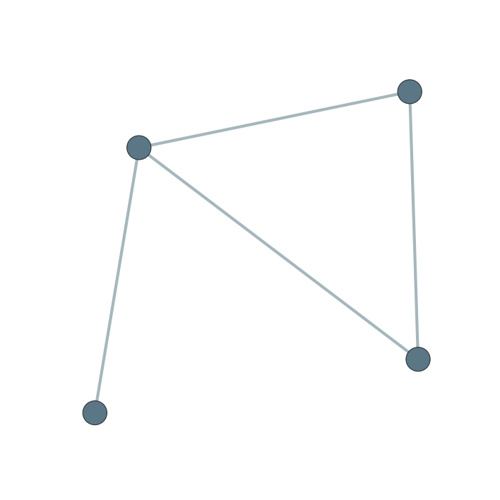

    !!! tip "Node Labels"
        In the above picture, the nodes do not have labels.
        This is because labels are automatically generated based on the node IDs provided in `g.mapping.node_ids`.
        When we created the graph using the `from_edge_index()` method, we did not provide any specific node IDs, so no IDs were assigned and no labels were generated.
        You can override the default behaviour by specifying `show_labels=True` in the `pp.plot()` function call.

### Node and Edge Customisation

You can customise the appearance of nodes and edges in both static and temporal networks.
We describe the different options below.

#### Static Networks

<div class="annotate" markdown>
In all backends, you can customise the `size`, `color`, and `opacity` of nodes and edges. 
You can specify these properties either as attributes of the `PyG` graph object `PathpyG.Graph.data` (as `torch.Tensor` or `numpy.ndarray` with one value per node/edge) or as arguments in the `pp.plot()` function call in three different ways: (1)

- A single value (applied uniformly to all nodes/edges)
- A list of values with length equal to the number of nodes/edges (values are applied in order)
- A dictionary mapping node/edge IDs to values (values are applied based on the IDs)

For `color`, you can use color names (e.g., `"blue"`), HEX codes (e.g., `"#ff0000"`), or RGB tuples (e.g., `(255, 0, 0)`).
You can also pass numeric values, which will be mapped to colors using a `matplotlib` colormap (specified via `cmap`).
</div>

1.  If both the graph attribute and the function argument are provided, the function argument takes precedence.

!!! example "Custom Node and Edge Properties"
    
    In the example below, we set custom properties for nodes and edges using all three methods.
    ```python
    import torch
    import pathpyG as pp

    # Example network data
    edges = [
        ("a", "b"),
        ("a", "c"),
        ("b", "d"),
        ("c", "d"),
        ("d", "a"),
    ]
    g = pp.Graph.from_edge_list(edges)

    # Add properties as attributes to the graph
    g.data["node_size"] = torch.tensor([10, 15, 20, 15])
    g.data["edge_color"] = torch.tensor([0, 1, 2, 1, 0])
    g.data["node_opacity"] = torch.zeros(g.n)

    # Create static plot with custom settings and display inline
    pp.plot(
        g,
        backend="tikz",
        node_color={"a": "red", "b": "#00FF00"},
        edge_opacity={("a", "b"): 0.1, ("a", "c"): 0.5, ("b", "d"): 1.0},
        node_opacity=1.0,  # override graph attribute
        edge_size=torch.tensor([1, 2, 3, 2, 1]),
    )
    ```
    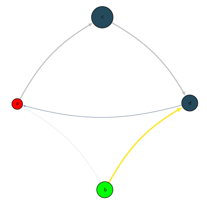

    ??? tip "Display Images inside your Nodes"
        `d3.js` additionally supports images as node representations.
        You can specify the image source using the `node_image` argument.
        The image source can be a URL or a local file path.
        ```python
        import torch
        import pathpyG as pp

        # Example network data
        edges = [
            ("b", "a"),
            ("c", "a"),
        ]
        mapping = pp.IndexMap(["a", "b", "c", "d"])
        g = pp.Graph.from_edge_list(edges, mapping=mapping)
        g.data["node_size"] = torch.tensor([25]*4)
        pp.plot(
            g,
            node_size={"d": 50},
            edge_size=5,
            node_image={
                "a": "https://avatars.githubusercontent.com/u/52822508?s=48&v=4",
                "b": "https://raw.githubusercontent.com/pyg-team/pyg_sphinx_theme/master/pyg_sphinx_theme/static/img/pyg_logo.png",
                "c": "https://pytorch-geometric.readthedocs.io/en/latest/_static/img/pytorch_logo.svg",
                "d": "docs/img/pathpy_logo_new.png",
            },
            show_labels=False,
        )
        ```
        <iframe src="plot/d3js_custom_node_images.html" width="650" height="520"></iframe>

#### Temporal Networks

For temporal networks, you can also customise the `size`, `color`, and `opacity` of nodes and edges at each timestep.
In our understanding, a temporal network has a fixed set of nodes, but edges appear at different timesteps.
Thus, all nodes exist at all times, but edges may only exist at certain timesteps.
Therefore, edge properties can be specified for each timestep where the edge exists.
In contrast, node properties can change at specified points in time, but will remain the same for all subsequent timesteps until they are changed again.

The customisation options work similarly to static networks, with the exception that passing a dictionary for node/edge properties requires adding the timestep to the key:

!!! example "Custom Node and Edge Properties in Temporal Networks"
    In the example below, we set the starting `node_color` and `node_size` for all nodes using graph attributes.
    We further customise the `edge_color` for each edge at each timestep using a graph attribute.
    Next, we override the `node_color` for node `"b"` at timestep `2` and for node `"a"` from the start using function arguments.
    Finally, we use a dictionary with a tuple consisting of the source node, target node, and timestep to set the `edge_size` for two specific edges at specific timesteps.

    ```python
    import torch
    import numpy as np
    import pathpyG as pp

    # Example temporal network data
    tedges = [
        ("a", "b", 1),
        ("a", "b", 2),
        ("b", "a", 3),
        ("b", "c", 3),
    ]
    t = pp.TemporalGraph.from_edge_list(tedges)
    t.data["node_size"] = torch.tensor([15, 8, 19])
    t.data["node_color"] = np.array(["blue", "green", "orange"])
    t.data["edge_color"] = torch.tensor([0, 1, 2, 1])

    # Create temporal plot and display inline
    pp.plot(
        t,
        backend="manim",
        node_opacity=0.5,
        edge_size={("a", "b", 1): 10, ("a", "b", 2): 1},
        node_color={("b", 2): "red", "a": "purple"}, # node_color for node 'a' is set to 'purple' from the start
    )
    ```
    <div class="video-wrapper">
        
    </div>

## Layouts

By default, `PathpyG` uses the Fruchterman-Reingold force-directed algorithm to compute node positions for static networks.
For temporal networks, the layout is computed dynamically at each timestep using the `d3.js` backend, while the `manim` backend uses a Fruchterman-Reingold layout computed on the aggregated static network by default.

### Static Networks
You can change the layout algorithm for static networks using the `layout` argument in the `pp.plot()` function call.

**networkx layouts:**

We currently support most layouts via the `networkx` library.
See the examples below for usage.

=== "Random"

    Use `"random"`, `"rand"` or `None` to specify a random layout.
    ```python
    import pathpyG as pp
    from torch_geometric import seed_everything
    seed_everything(42)

    g = pp.algorithms.generative_models.watts_strogatz(30, 2, 0.25)
    pp.plot(g, backend="tikz", layout="random")
    ```
    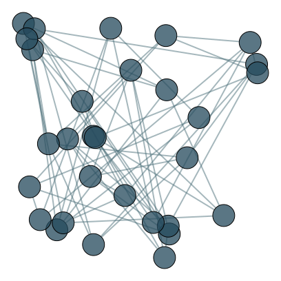

=== "Circular"

    Use `"circular"`, `"circle"`, `"ring"`, `"1d-lattice"`, or `"lattice-1d"` to specify a circular layout.
    ```python
    import pathpyG as pp
    from torch_geometric import seed_everything
    seed_everything(42)

    g = pp.algorithms.generative_models.watts_strogatz(30, 2, 0.25)
    pp.plot(g, backend="tikz", layout="circular")
    ```
    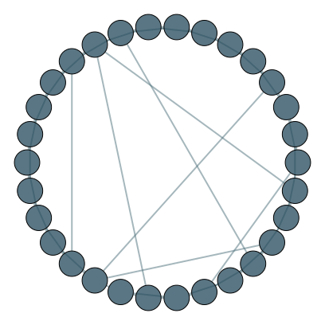

=== "Shell"

    Use `"shell"`, `"concentric"`, `"concentric-circles"`, or `"shell layout"` to specify a shell layout.
    ```python
    import pathpyG as pp
    from torch_geometric import seed_everything
    seed_everything(42)

    g = pp.algorithms.generative_models.watts_strogatz(30, 2, 0.25)
    pp.plot(g, backend="tikz", layout="shell")
    ```
    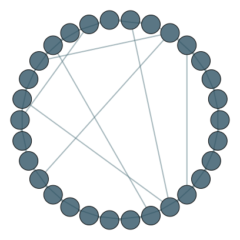

=== "Spectral"

    Use `"spectral"`, `"eigen"`, or `"spectral layout"` to specify a spectral layout.
    ```python
    import pathpyG as pp
    from torch_geometric import seed_everything
    seed_everything(42)

    g = pp.algorithms.generative_models.watts_strogatz(30, 2, 0.25)
    pp.plot(g, backend="tikz", layout="spectral")
    ```
    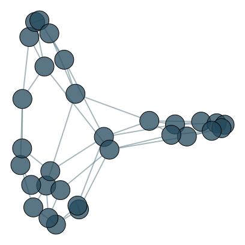

=== "Kamada-Kawai"

    Use `"kamada-kawai"`, `"kamada_kawai"`, `"kk"`, `"kamada"`, or `"kamada layout"` to specify a Kamada-Kawai layout.
    ```python
    import pathpyG as pp
    from torch_geometric import seed_everything
    seed_everything(42)

    g = pp.algorithms.generative_models.watts_strogatz(30, 2, 0.25)
    pp.plot(g, backend="tikz", layout="kamada-kawai")
    ```
    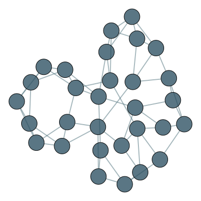

=== "Fruchterman-Reingold"

    Use `"fruchterman-reingold"`, `"fruchterman_reingold"`, `"fr"`, `"spring_layout"`, `"spring layout"`, or `"spring"` to specify a Fruchterman-Reingold layout.
    ```python
    import pathpyG as pp
    from torch_geometric import seed_everything
    seed_everything(42)

    g = pp.algorithms.generative_models.watts_strogatz(30, 2, 0.25)
    pp.plot(g, backend="tikz", layout="fruchterman-reingold")
    ```
    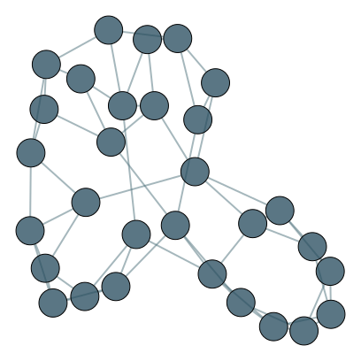

=== "ForceAtlas2"

    Use `"forceatlas2"`, `"fa2"`, `"forceatlas"`, `"force-atlas"`, `"force-atlas2"`, or `"fa 2"` to specify a ForceAtlas2 layout.
    ```python
    import pathpyG as pp
    from torch_geometric import seed_everything
    seed_everything(42)

    g = pp.algorithms.generative_models.watts_strogatz(30, 2, 0.25)
    pp.plot(g, backend="tikz", layout="forceatlas2")
    ```
    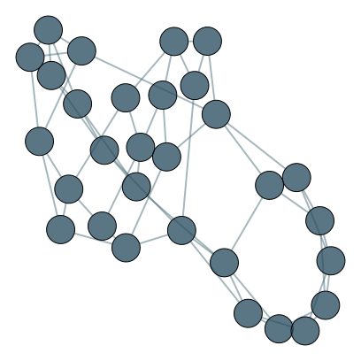

**Other layouts:**
In addition to the `networkx` layouts, we also support:

- Grid layout

    ??? example

        ```python
        import pathpyG as pp
        from torch_geometric import seed_everything
        seed_everything(42)

        g = pp.algorithms.generative_models.watts_strogatz(30, 2, 0.25)
        pp.plot(g, backend="tikz", layout="grid", filename="tikz_grid_layout.svg")
        ```
        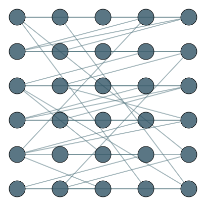

- Custom layout (by providing a dictionary mapping node IDs to positions)

    ??? example

        ```python
        
        import pathpyG as pp

        g = pp.Graph.from_edge_list([("a", "b"), ("a", "c"), ("b", "d"), ("c", "d"), ("d", "a")])
        # Provide custom x and y coordinates for a layout
        layout = {
            "a": (0, 0),
            "b": (1, 0),
            "c": (0, 1),
            "d": (1, 1)
        }
        pp.plot(g, backend="tikz", layout=layout, filename="tikz_layout.svg")
        ```
        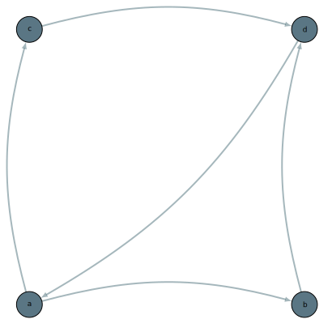

### Temporal Networks

We apply a sliding window approach to compute layouts for temporal networks.
At each timestep, we consider a window of past and future timesteps (controlled via the `layout_window_size` argument) and aggregate all edges inside this window to a static graph to compute the layout.
You can either pass a fixed integer value, which will then be split equally into past and future timesteps, or a tuple specifying the number of past and future timesteps separately.
The layout algorithm can be any of the supported static layout algorithms described above.

!!! example "Custom Layout for Temporal Networks"
    
    In the example below, we use a sliding window of `2`, meaning that we aggregate the current and one previous timestep to compute the layout at each timestep.
    ```python
    import pathpyG as pp

    # Example temporal network data
    tedges = [
        ("a", "b", 1),
        ("a", "b", 2),
        ("b", "a", 3),
        ("b", "c", 3),
        ("d", "c", 4),
        ("a", "b", 4),
        ("c", "b", 4),
        ("c", "d", 5),
        ("b", "a", 5),
        ("c", "b", 6),
    ]
    t = pp.TemporalGraph.from_edge_list(tedges)

    # Create temporal plot and display inline
    pp.plot(t, backend="manim", layout_window_size=2, layout="fa2")
    ```
    <div class="video-wrapper">
        
    </div>

## Customisation Options

Below is full list of supported keyword arguments for each backend and their descriptions.

| Argument                  | d3.js | manim | matplotlib | tikz | Short Description                             |
| ------------------------- | :-----: | :-----: | :-----: | :-----: | --------------------------------------------- |
| **General**               |           |           |           |           |                                               |
| `default_backend`      |     ✔️    |     ✔️    |     ✔️    |     ✔️    | Backend to use when none is specified         |
| `cmap`                   |     ✔️    |     ✔️    |     ✔️    |     ✔️    | Colormap (string that refers to matplotlib cmap) for scalar node/edge values          |
| `layout`                 |     ✔️    |     ✔️    |     ✔️    |     ✔️    | Layout algorithm for static networks (see [Layouts](#layouts))         |
| `width`                   |     ✔️   |      ❌   |      ✔️   |    ✔️   | Width of the output               |
| `height`                  |     ✔️   |      ❌   |      ✔️   |    ✔️   | Height of the output                   |
| `latex_class_options` |    ❌    |     ❌    |     ❌    |     ✔️    | LaTeX document class options (e.g., `"border=2mm"`) for `tikz` backend |
| `margin`                |     ✔️    |     ❌    |     ✔️    |     ✔️    | Margin around the plot area (in pixels for `d3.js`, in points for `matplotlib` and `tikz`) |
| `curvature`              |     ✔️    |     ❌    |     ❌    |     ✔️    | Curvature of edges (0: straight, >0: curved)      |
| `layout_window_size`      |    ✔️    |     ✔️    |     ❌    |     ❌    | Size of sliding window for temporal network layouts (int or tuple of int) |
| `delta`                   |    ✔️    |     ✔️    |   ❌      |     ❌   | Duration of timestep in milliseconds (ms)                      |
| `separator`               |     ✔️    |     ✔️    |     ✔️    |     ✔️    | Separator for higher-order node labels        |
| **Nodes**                 |           |           |           |           |                                               |
| `size`               |     ✔️    |     ✔️    |      ✔️   |    ✔️     | Radius of nodes (uniform or per-node)         |
| `color`              |     ✔️    |     ✔️    |     ✔️    |     ✔️    | Node fill color           |
| `opacity`            |      ✔️   |     ✔️    |      ✔️   |      ✔️   | Node fill opacity (0 transparent, 1 solid)    |
| `image_padding`          |      ✔️   |      ❌   |     ❌    |      ❌   | Padding around node images (in pixels)        |
| **Edges**                 |           |           |           |           |                                               |
| `size`               |      ✔️   |     ✔️    |    ✔️     |    ✔️     | Edge width (uniform or per-edge)              |
| `color`              |     ✔️    |     ✔️    |    ✔️     |     ✔️    | Edge line color          |
| `opacity`            |     ✔️    |     ✔️    |     ✔️    |    ✔️     | Edge line opacity (0 transparent, 1 solid)    |

**Legend:** ✔️ Supported ❌ Not Supported 

You can find the default values for each argument in `pathpyG.toml` located in the `pathpyG` installation directory.

!!! note "Node and Edge Keyword Arguments"

    The node and edge keyword arguments listed above represent the default options that are specified via the `pathpyG.toml` configuration file.
    You can change these defaults using keyword arguments in the `pp.plot()` function call as follows:
    ```python
    import pathpyG as pp

    # Example network data
    g = pp.Graph.from_edge_list([("a", "b"), ("a", "c")])

    # Create network plot and display inline
    pp.plot(g, node={"opacity": 0.2}, filename="d3js_node_opacity.html")
    ```
    <iframe src="plot/d3js_node_opacity.html" width="650" height="520"></iframe>

    However, if you want to change either `color`, `size`, or `opacity` for nodes or edges, the preferred way is to use the dedicated keyword arguments described in the previous sections.

---
For more details and usage examples, see [Manim Visualisation Tutorial](/tutorial/manim_tutorial),[Visualisation Tutorial](/tutorial/visualisation) and [Develop your own plot Functions](/plot_tutorial)
